# Hello, world!

- Principal Program Manager at Microsoft for Azure Files and File Sync.
- Focusing on cost optimization, file share management, networking, SMB, documentation, and technical talks.
- Interested in PowerShell, C#, TypeScript, and Rust.

## Talks
<table>
    <tr>
        <td><a href="https://www.youtube.com/watch?v=9ljANVZPNZk">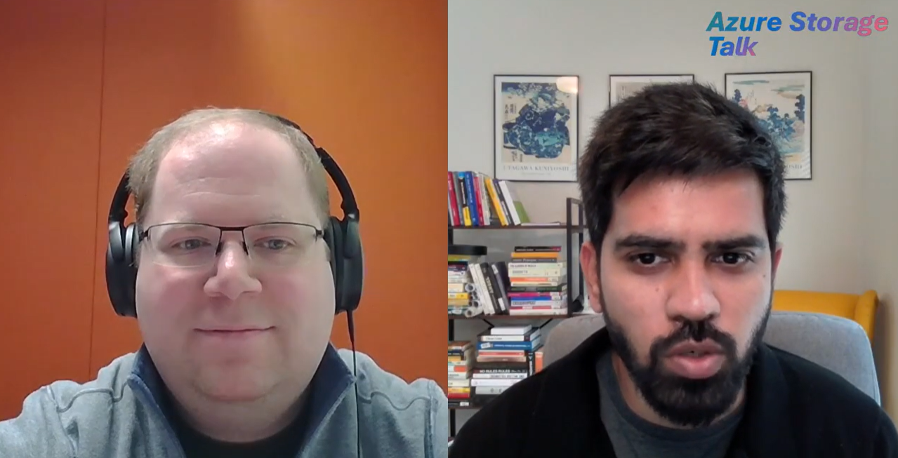</a></td>
        <td>
            <h3><a href="https://www.youtube.com/watch?v=9ljANVZPNZk">Provisioned v2 Billing Model for Azure Files</a></h3>
            <h4>
                Nataraj Sindam, Will Gries 
                2025-11-25
            </h4>
        </td>
    </tr>
    <tr>
        <td><a href="https://www.youtube.com/watch?v=9hnyIN0NnI4">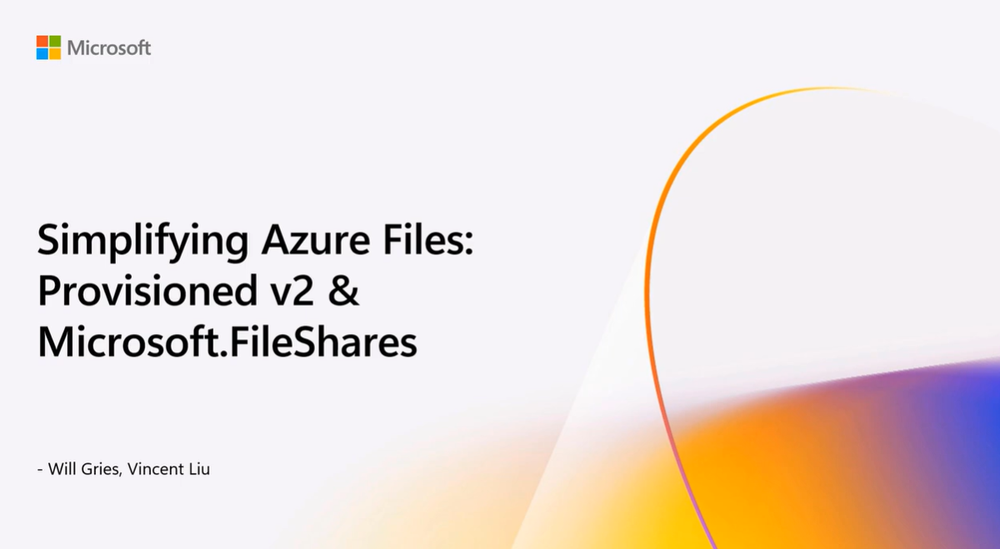</a></td>
        <td>
            <h3><a href="https://www.youtube.com/watch?v=9hnyIN0NnI4">Simplifying Azure Files: Provisioned v2 and Microsoft.FileShares</a></h3>
            <h4>
                Will Gries, Vincent Liu 
                2025-11-18
            </h4>
        </td>
    </tr>
    <tr>
        <td><a href="https://www.msclouditpropodcast.com/episode413/">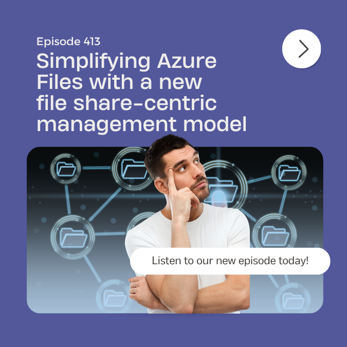</a></td>
        <td>
            <h3><a href="https://www.msclouditpropodcast.com/episode413/">MS Cloud IT Pro podcast, episode 413: Simplifying Azure Files with a new file share-central management model</a></h3>
            <h4>
                Scott Hoag, Ben Stegink, Will Gries 
                2025-10-23
            </h4>
        </td>
    </tr>
    <tr>
        <td><a href="https://www.youtube.com/watch?v=T5eKHDwZe3M">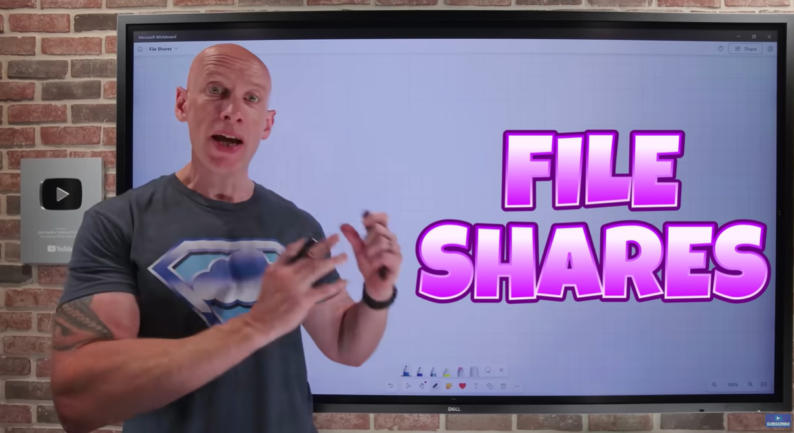</a></td>
        <td>
            <h3><a href="https://www.youtube.com/watch?v=T5eKHDwZe3M">NEW File Shares Resource Types</a></h3>
            <h4>
                John Savill 
                2025-09-10
            </h4>
        </td>
    </tr>
    <tr>
        <td><a href="https://www.youtube.com/watch?v=Tb6y0fvJBMs">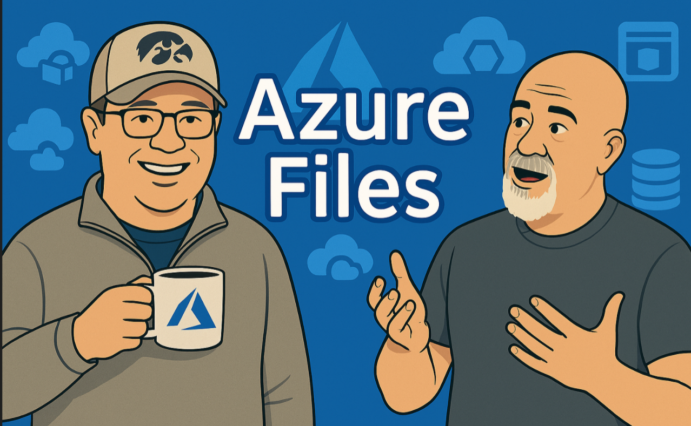</a></td>
        <td>
            <h3><a href="https://www.youtube.com/watch?v=Tb6y0fvJBMs">E2E 10-Minute Drill - Azure Files Provisioned V2: Flexibility, Performance & Cost Savings</a></h3>
            <h4>
                Pierre Roman, Will Gries 
                2025-08-14
            </h4>
        </td>
    </tr>
    <tr>
        <td><a href="https://www.youtube.com/watch?v=dyqQkheaHYg">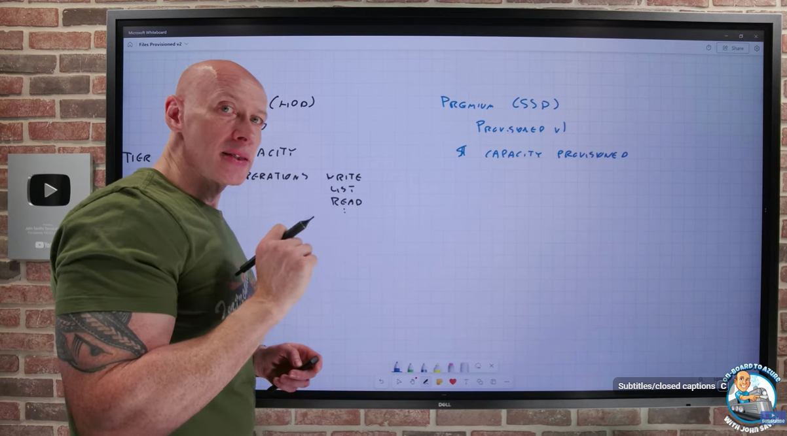</a></td>
        <td>
            <h3><a href="https://www.youtube.com/watch?v=dyqQkheaHYg">Azure Files Provisioned v2 Overview</a></h3>
            <h4>
                John Savill 
                2025-01-15
            </h4>
        </td>
    </tr>
    <tr>
        <td><a href="https://www.youtube.com/watch?v=m5_-GsKv4-o">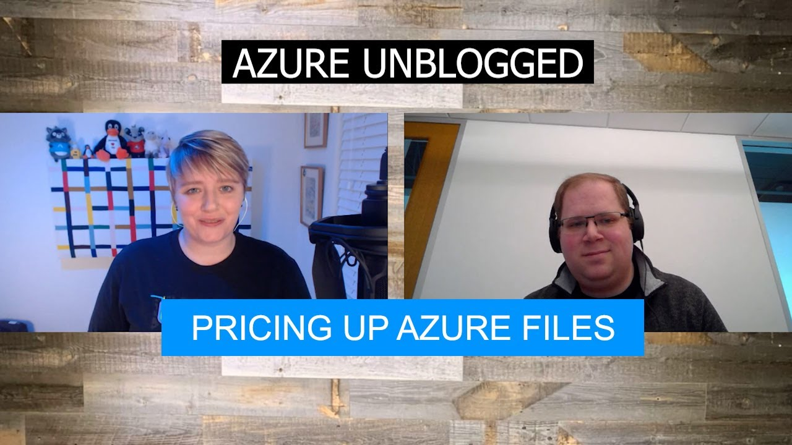</a>
        </td>
        <td>
            <h3><a href="https://www.youtube.com/watch?v=m5_-GsKv4-o">Pricing up Azure Files</a></h3>
            <h4>
                Sarah Lean, Will Gries 
                2021-03-30
            </h4>
        </td>
    </tr>
    <tr>
        <td><a href="https://www.youtube.com/watch?v=jd49W33DxkQ">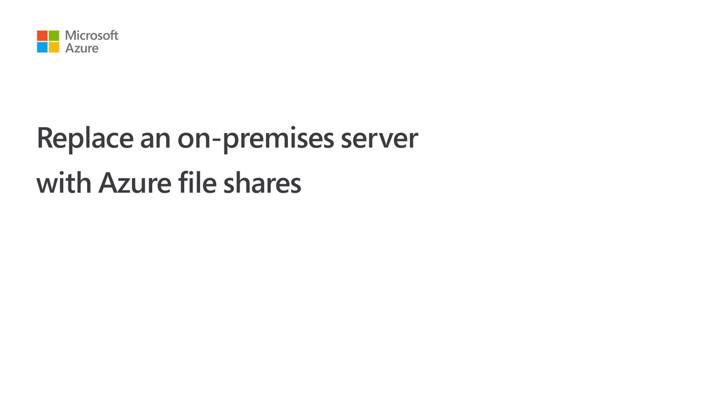</a></td>
        <td>
            <h3><a href="https://www.youtube.com/watch?v=jd49W33DxkQ">Replace an on-premises server with Azure file shares</a></h3>
            <h4>
                Will Gries 
                2020-09-21
            </h4>
        </td>
    </tr>
    <tr>
        <td><a href="https://www.youtube.com/watch?v=H04e9AgbcSc">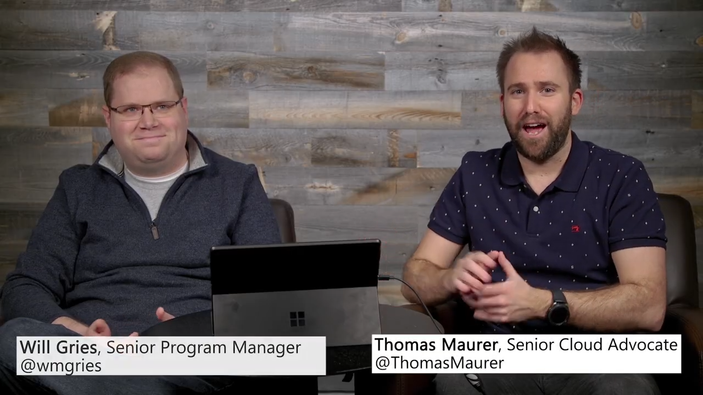</a>
        </td>
        <td>
            <h3><a href="https://www.youtube.com/watch?v=H04e9AgbcSc">Replace your file server with a serverless Azure file share!</a></h3>
            <h4>
                Thomas Maurer, Will Gries 
                2020-02-24
            </h4>
        </td>
    </tr>
    <tr>
        <td><a href="https://www.youtube.com/watch?v=6E2p28XwovU">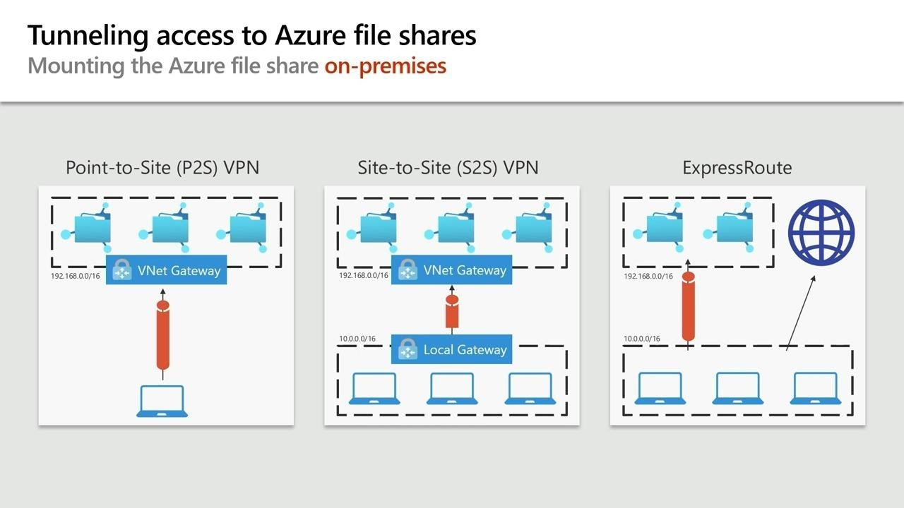</a></td>
        <td>
            <h3><a href="https://www.youtube.com/watch?v=6E2p28XwovU">Bringing file services into the 2020s: Migrate SMB and NFS file shares to the cloud</a></h3>
            <h4>
                Fabian Uhse, Will Gries 
                2019-11-08
            </h4>
        </td>
    </tr>
    <tr>
        <td><a href="https://www.youtube.com/watch?v=GMzh2M66E9o">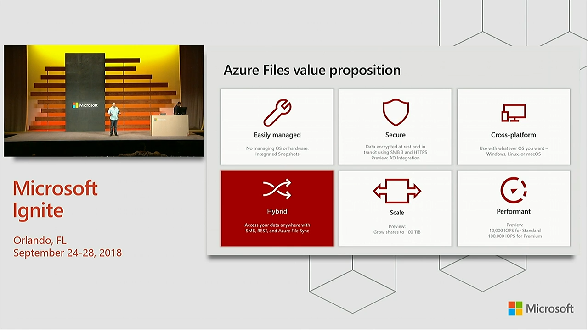</a></td>
        <td>
            <h3><a href="https://www.youtube.com/watch?v=GMzh2M66E9o">Azure Files in 2018: Bigger faster better!</a></h3>
            <h4>
                Mike Emard, Will Gries 
                2018-09-27
            </h4>
        </td>
    </tr>
    <tr>
        <td><a href="https://www.youtube.com/watch?v=zWV8TKBp2Kk">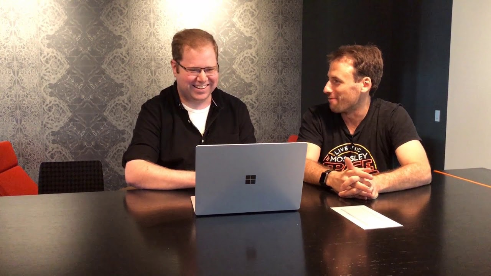</a></td>
        <td>
            <h3><a href="https://www.youtube.com/watch?v=zWV8TKBp2Kk">What up with Azure File Sync</a></h3>
            <h4>
                Corey Sanders, Will Gries 
                2018-09-18
            </h4>
        </td>
    </tr>
    <tr>
        <td><a href="https://www.youtube.com/watch?v=C0VClfBk-wY">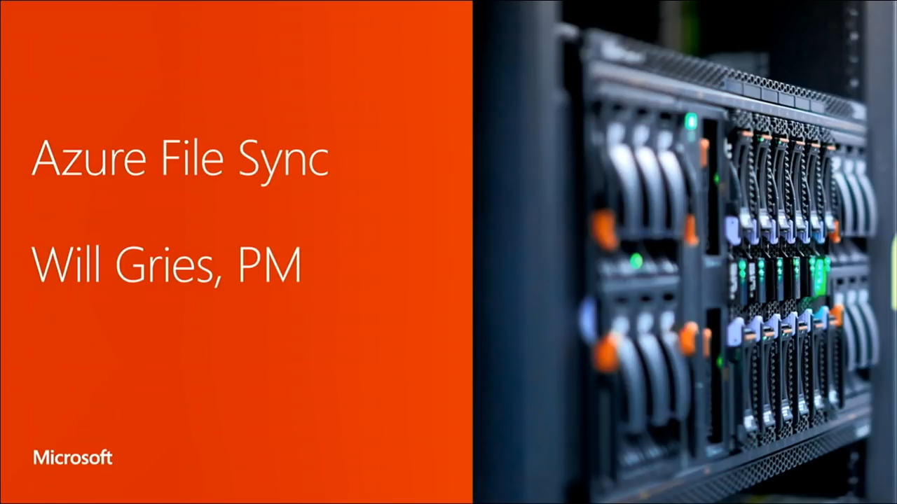</a></td>
        <td>
            <h3><a href="https://www.youtube.com/watch?v=C0VClfBk-wY">Windows Server: What's new and what's next</a></h3>
            <h4>
                Erin Chapple, Chris Van Wesep, Jeff Woolsey, Will Gries 
                2017-09-28
            </h4>
        </td>
    </tr>
    <tr>
        <td><a href="https://www.youtube.com/watch?v=mlparvq434I">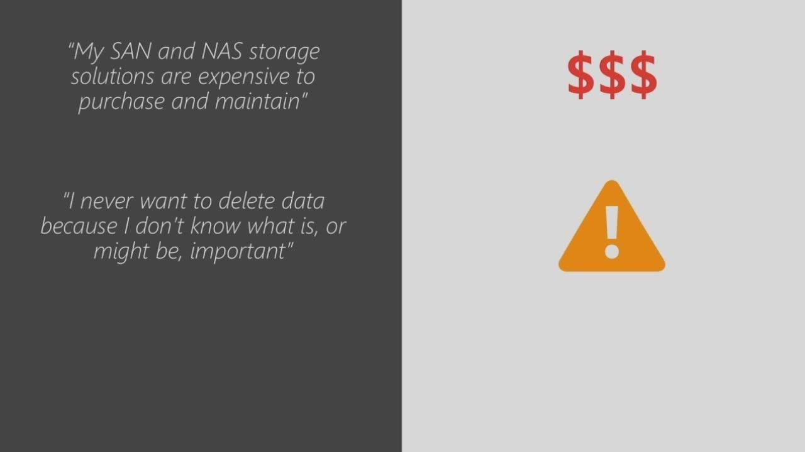</a></td>
        <td>
            <h3><a href="https://www.youtube.com/watch?v=mlparvq434I">Maximize storage efficiency and conquer distributed file access with Windows Server and Azure</a></h3>
            <h4>
                Will Gries, Fabian Uhse 
                2017-09-27
            </h4>
        </td>
    </tr>
</table>

## Blog posts
| Title | Author | Date |
|-|-|-|
| [Simplifying file share management and control for Azure Files](https://techcommunity.microsoft.com/blog/azurestorageblog/simplifying-file-share-management-and-control-for-azure-files/4452634) | Will Gries | 2025-09-09 |
| [Lower costs and boost flexibility with Azure Files provisioned v2](https://techcommunity.microsoft.com/blog/azurestorageblog/lower-costs-and-boost-flexibility-with-azure-files-provisioned-v2/4443621) | Will Gries | 2025-08-14 |
| [Azure Files provisioned v2 model for flexibility, cost savings, and predictability](https://techcommunity.microsoft.com/blog/azurestorageblog/azure-files-provisioned-v2-billing-model-for-flexibility-cost-savings-and-predic/4364093) | Will Gries (as Vybava Ramadoss) | 2025-01-09 |
| [Score one for the IT Pro: Azure File Sync is now generally available](he-it-pro-azure-file-sync-is-now-generally-available/) | Will Gries (as Tad Brockway) | 2018-07-19 |
| [Windows Server 2016 NTFS sparse file/Data Deduplication users: please install KB4025334](https://techcommunity.microsoft.com/blog/filecab/windows-server-2016-ntfs-sparse-filedata-deduplication-users-please-install-kb40/426018) | Will Gries | 2017-07-20 |
| [Configuring Nano Server and Dedup](https://techcommunity.microsoft.com/blog/filecab/configuring-nano-server-and-dedup/425745) | Will Gries | 2016-04-10 |
| [Data Deduplication in Windows Server 2016](https://techcommunity.microsoft.com/blog/filecab/data-deduplication-in-windows-server-2016/425738) | Will Gries | 2016-04-01 |
| [Announcing the Data Classification Toolkit for Windows Server 2012 R2!](https://techcommunity.microsoft.com/blog/filecab/announcing-the-data-classification-toolkit-for-windows-server-2012-r2/425365) | Will Gries | 2014-06-18 |