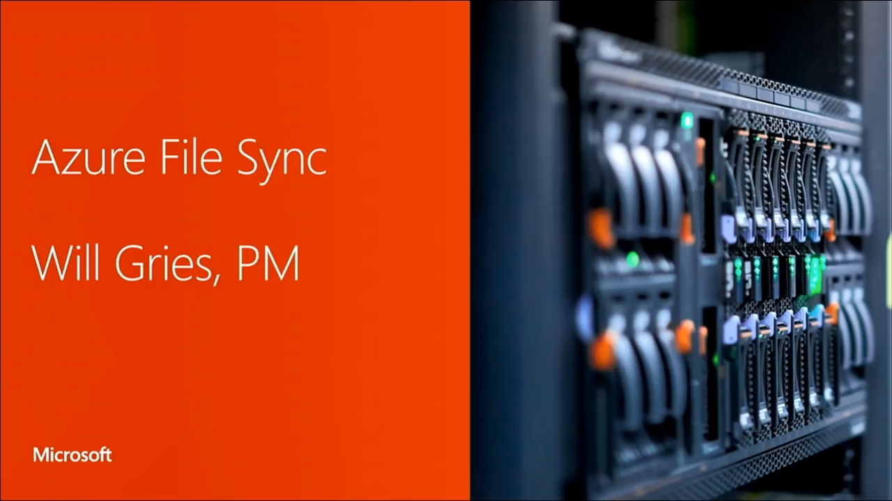

# Hello, world!

- Senior Program Manager at Microsoft for Azure Files, Azure File Sync, and Data Deduplication
- Focusing on cost optimization, file share management, networking, SMB, documentation, and technical talks.
- Interested in PowerShell, C#, TypeScript, and Rust.

## Talks
<table>
    <tr>
        <td>
        </td>
        <td>
            <h3><a href="https://www.youtube.com/watch?v=m5_-GsKv4-o">Pricing up Azure Files</a></h3>
            <h4>2021-03-30</h4>
        </td>
    </tr>
    <tr>
        <td></td>
        <td>
            <h3><a href="https://www.youtube.com/watch?v=jd49W33DxkQ">Replace an on-premises server with Azure file shares</a></h3>
            <h4>2020-09-21</h4>
        </td>
    </tr>
    <tr>
        <td>
        </td>
        <td>
            <h3><a href="https://www.youtube.com/watch?v=H04e9AgbcSc">Replace your file server with a serverless Azure file share!</a></h3>
            <h4>2020-02-24</h4>
        </td>
    </tr>
    <tr>
        <td></td>
        <td>
            <h3><a href="https://www.youtube.com/watch?v=6E2p28XwovU">Bringing file services into the 2020s: Migrate SMB and NFS file shares to the cloud</a></h3>
            <h4>2019-11-08</h4>
        </td>
    </tr>
    <tr>
        <td></td>
        <td>
            <h3><a href="https://www.youtube.com/watch?v=GMzh2M66E9o">Azure Files in 2018: Bigger faster better!</a></h3>
            <h4>2018-09-27</h4>
        </td>
    </tr>
    <tr>
        <td></td>
        <td>
            <h3><a href="https://www.youtube.com/watch?v=zWV8TKBp2Kk">What up with Azure File Sync</a></h3>
            <h4>2018-09-18</h4>
        </td>
    </tr>
    <tr>
        <td></td>
        <td>
            <h3><a href="https://www.youtube.com/watch?v=C0VClfBk-wY">Windows Server: What's new and what's next</a></h3>
            <h4>2017-09-28</h4>
        </td>
    </tr>
    <tr>
        <td></td>
        <td>
            <h3><a href="https://www.youtube.com/watch?v=mlparvq434I">Maximize storage efficiency and conquer distributed file access with Windows Server and Azure</a></h3>
            <h4>2017-09-27</h4>
        </td>
    </tr>
</table>